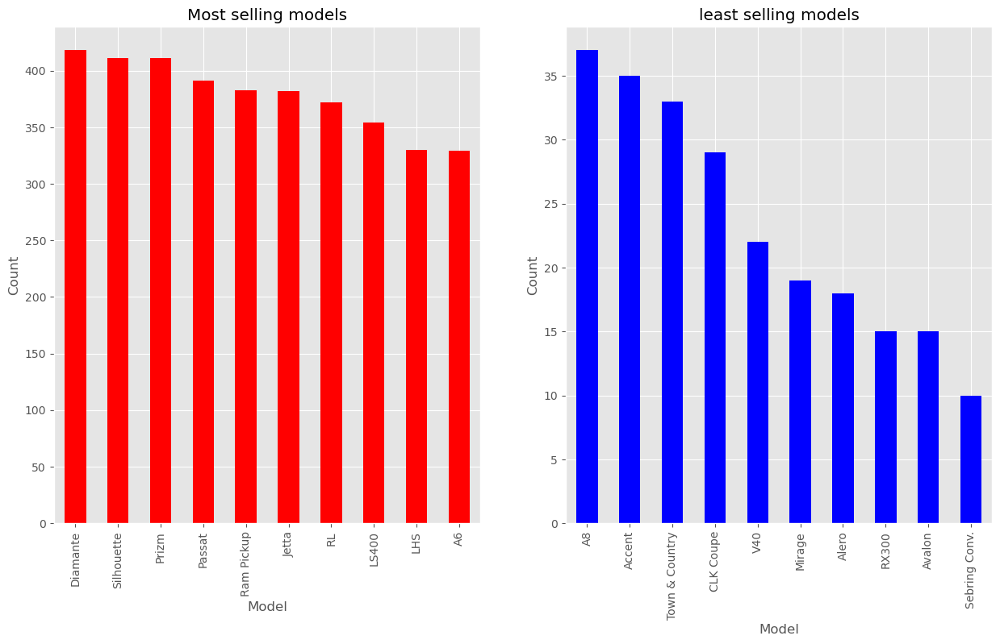
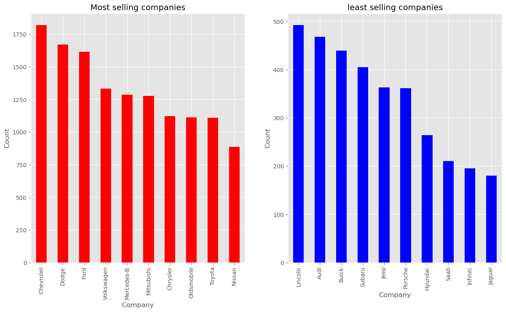
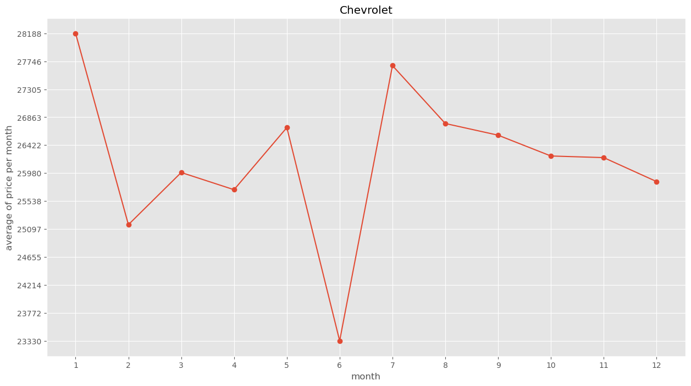
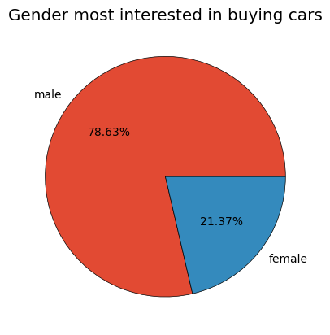

# Car Sales Analysis Project

## Project Overview
This project aims to analyze car sales data to uncover insights into customer preferences, sales trends, and performance metrics across different car models, companies, and styles. Through rigorous data analysis, we have explored various aspects of the data, including sales distribution among models and companies, customer demographics, and predictive modeling to forecast sales.

## Dataset
The dataset includes comprehensive details of car sales transactions, covering aspects such as model, company, transmission type, customer demographics, and more. Our analysis confirms that the dataset is complete with no missing data, ensuring a solid foundation for our analysis.

## Key Findings

### Sales Analysis
- **Top Selling Models**: Analysis reveals that 'Diamante' leads with over 400 units sold, followed by the next 9 top-selling models.
- **Least Selling Models**: Analysis reveals that  'SebringConv' emerges as the least sold model, highlighting models that are less popular among customers.

- **Top Selling Companies**:  Analysis reveals that 'Chevrolet' is at the forefront with over 1750 units sold, leading the top 10 selling companies.
- **Least Selling Companies**:  Analysis reveals that 'Jaguar' has the least units sold, indicating its position in the market compared to other brands.

### Sales Evolution
- Monthly sales evolution for each company the below example is for chevrolet.

### Customer Demographics
- A significant majority of car buyers are male, accounting for 78.6% of our dataset.
- Annual income analysis shows that individuals earning between [500,000 and 1,000,000] and [1,000,000 and 3,000,000] are most likely to purchase cars.

### Preferences
- Automatic transmission is preferred over manual by both male and female customers.
- SUVs and Hatchbacks are the most favored body styles among customers.

### Model Popularity by Company
- The most popular models for Nissan is Pathfinder. we can also see all the models for all companies in the code. below is the example for nissan

### Pricing and Expense Analysis
- The analysis provides a list of the most expensive models, offering insights into the premium segment.
- The division of the dataset into income categories helps further understand customer buying power and preferences.

### Clustering and Predictive Modeling
- Using the Elbow method, we identified that the optimal number of clusters for our data is 3, based on the variance drop rate.
- The clusters are distinguishable by price ranges, with centroids marking the cluster centers.
- Label encoding has been applied to transform categorical data into numerical format for model compatibility.
- A 3D visualization of PCA clusters offers a detailed perspective on the data's distribution.
- The Random Forest Regressor emerged as the most effective model, with an MAE of 4505.864 and an R^2 of 0.634.

## Conclusion
Our comprehensive analysis of car sales data has provided valuable insights into market trends, customer preferences, and predictive modeling. The findings will aid stakeholders in making informed decisions and strategizing effectively in the automotive industry. The Random Forest Regressor, selected for its superior performance, will be instrumental in predicting future sales and trends.

## Future Work
Further analysis could explore deeper into the causative factors behind the trends observed and expand the predictive modeling to include more variables for even more accurate forecasts.

